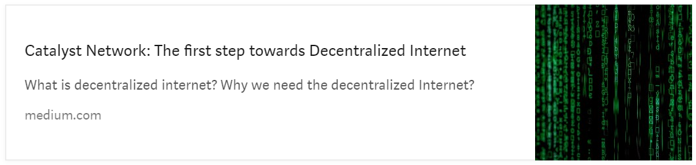
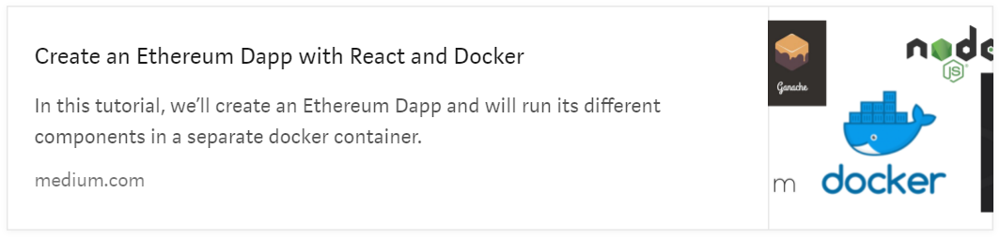
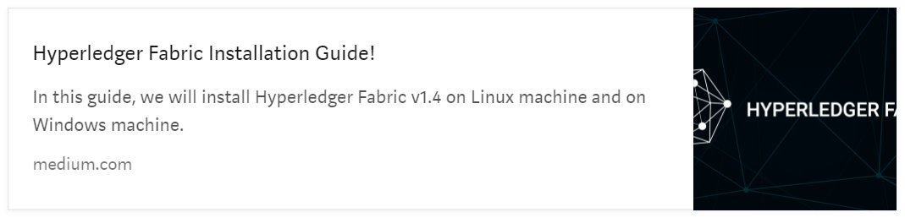
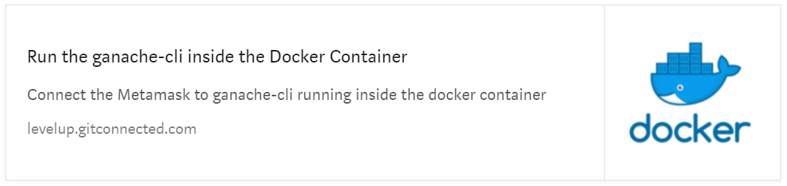
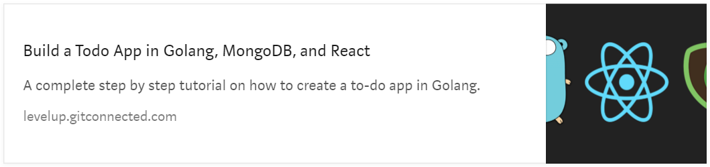
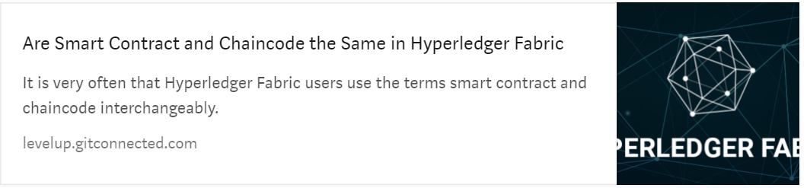
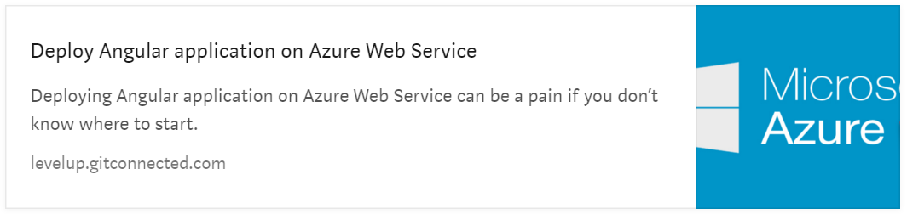

# blogs
Reference links of all the published blogs. 

# Catalyst Network: The first step towards Decentralized Internet  

# Create an Ethereum Dapp with React and Docker  

# Hyperledger Fabric Installation Guide!

# Run the ganache-cli inside the Docker Container

# Build a Todo App in Golang, MongoDB, and React  

# Are Smart Contract and Chaincode Same in Hyperledger Fabric?

# How to Deploy an Angular application to Azure Web Service

